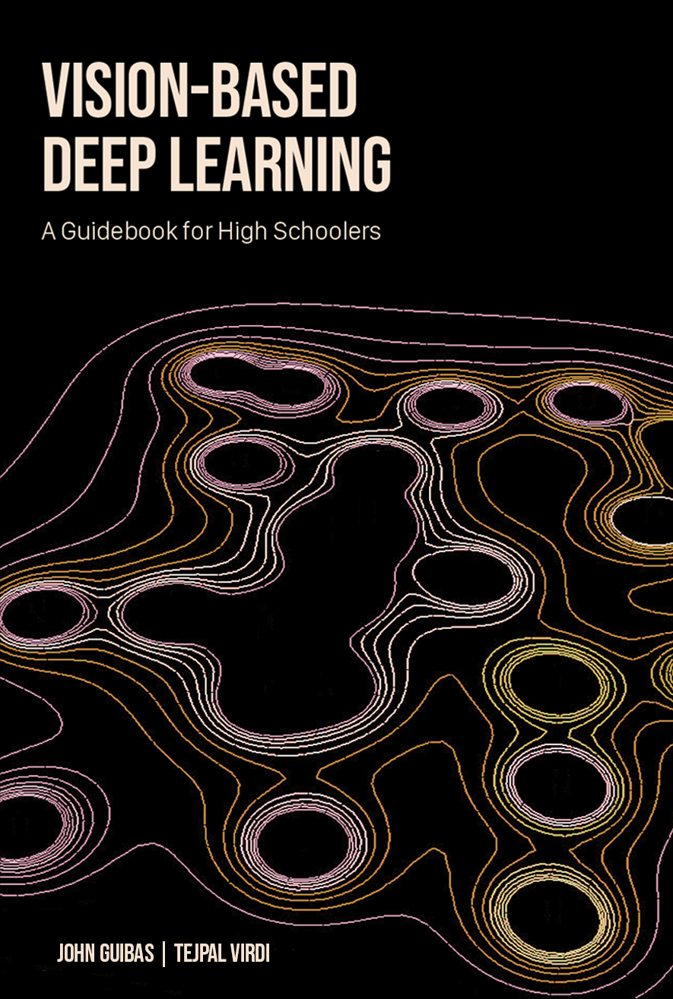
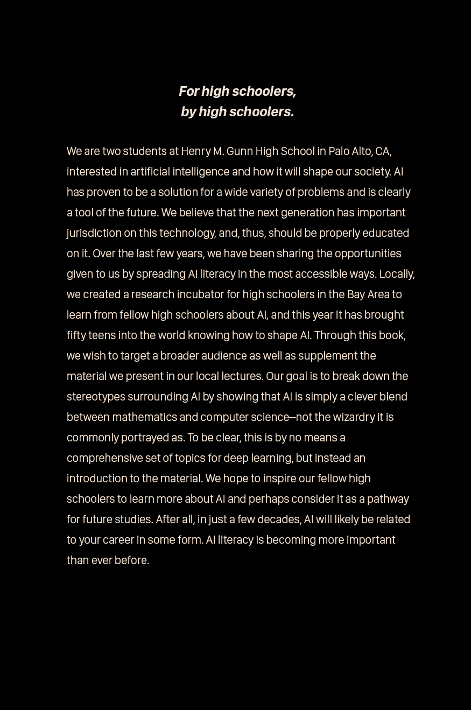

# Vision-Based Deep Learning: A Guidebook for High Schoolers

# # Introduction:

Artificial Intelligence (AI) is on track to shake up our lives in unimaginable ways; from self-driving cars to automated medical diagnosis, there is a lot to consider in a world integrated with intelligent machines. But, even though the field is making leaps of progress, there is still one pressing concern: AI is only understood by a small fraction of the general population. It may not be entirely obvious, but AI has already seeped into our lives in numerous ways: Google’s personal assistant uses Natural Language Processing for human-like communication, Amazon utilizes purchase prediction to keep you buying more, Twitter uses Machine Learning to personalize your timeline, and the list goes on. It is predicted that in the next 5 years, 45% of companies are planning to use machine learning, and by 2030 the AI industry will be worth $15.7 trillion, with 33% of jobs being replaced by robots. So, what can you do to prepare for this fourth industrial revolution? Become AI literate. Although AI is catching the public eye, it’s happening in the wrong way. The buzzword “Artificial Intelligence” is being overhyped to the point where it is seen as science fiction. Even a large chunk of coverage on AI gives the impression that researchers have built generally intelligent robots that should be feared. Sure that might be enthralling, but the reality is that AI is not as magical, nor intelligent, as it is being portrayed. It's important to understand that the theory and application of AI is not magic; it’s Math and Computer Science. This isn’t a big stretch from our current educational requirements. With the spread of AI, it is likely that the career one is pursuing will be assisted or possibly fully taken over by it. Even fields that have numerous educational prerequisites, such as Law and Medicine, are being revolutionized by AI. Consequently, current freshman in high school, who graduate college in 2026, will have a career dramatically impacted by AI, and, if not properly educated on it, they will be at a severe disadvantage. Especially with the growing role of AI in industry, its illogical for schools to not keep up with it in terms of education. This is a guidebook for high schoolers to learn the core concepts of deep learning, which is the current most popular collection of techniques to create artificial intelligence. The material is presented from the point of view of two high schoolers, so it is only expected that the reader understands traditional high school math and computer science content. We will take it from there.

 
 

